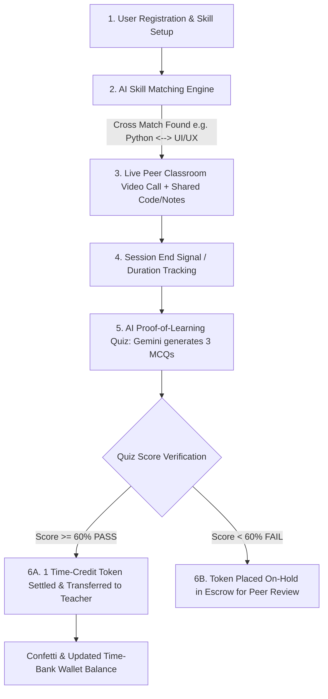

# 🎓 SkillSwap: AI-Powered Peer-to-Peer Time-Credit Skill Exchange Network
> **Aligned with United Nations Sustainable Development Goal 4: Quality Education**  
> *"Learn with time, not money: Teach one hour ➔ Earn one Time-Credit ➔ Use it to learn another skill."*

---

## 🌟 Problem Statement
There is a massive economic gap in access to affordable, high-quality skill education. Students often cannot afford expensive paid platforms such as Coursera or Udemy. Furthermore, traditional systems lack a structured, verified peer-to-peer barter network that enables students to learn directly from one another without financial barriers.

## 💡 Solution: The Time-Bank Model
**SkillSwap** introduces an intelligent time-based skill exchange network using a Time-Bank economic model:
1. **Zero Cash Required:** When **Student A** teaches **Student B** for 1 hour, Student A earns **1 Time-Credit Token**.
2. **Infinite Skill Liquidity:** Student A can spend that token to learn another skill from **Student C**.
3. **Free Welcome Token:** Every newly registered student receives **1 Free Welcome Token** to get started immediately without upfront barriers.
4. **AI Proof-of-Learning (Main USP):** Tokens are only transferred after the learner takes a dynamic 3-question MCQ quiz generated by **Google Gemini AI**. A score of **≥60%** is required to release the token from escrow to the teacher.

---

## 🛠️ Technology Stack

| Layer | Technology | Purpose |
| :--- | :--- | :--- |
| **Frontend** | React 19 + Vite 6 | Lightning-fast, interactive single-page application |
| **Styling** | Vanilla CSS Glassmorphism | Custom design tokens, dark theme, smooth micro-animations |
| **Backend** | Node.js + Express 5 | API routing, Gemini AI proxy, production static serving |
| **Database** | Supabase (PostgreSQL) | Cloud profiles, sessions, token ledger, Row Level Security |
| **Live P2P Video** | WebRTC MediaStream | Peer video, microphone, and screen sharing workspace |
| **AI Verification** | Google Gemini 1.5 Flash | Dynamic 3-MCQ comprehension quiz generator |
| **Deployment** | GitHub + Render | Continuous integration & free cloud hosting |

---

## 🔄 End-to-End System Workflow



---

## 🚀 Key Modules for Demo
1. **User Dashboard:** Profile, interactive Skill Matrix tagger (Skills I Teach / Skills I Want to Learn), live Time-Bank token balance, and transaction ledger.
2. **AI Skill Matchmaker:** Real-time cross-match compatibility algorithm ranking peers (e.g. 98% 2-Way Match).
3. **In-App Peer Classroom:** WebRTC live video streams, mic/camera/screen-share controls, shared code editor with syntax execution, shared lesson notes, and live chat.
4. **Fast-Forward Demo Mode:** 45-minute lesson simulation trigger for zero-delay presentations.
5. **AI Quiz Verification Popup:** 3 dynamic comprehension questions with instant grading, token transfer animation, and celebration confetti.
6. **Supabase Cloud Integration:** Built-in connection tester and 1-click SQL schema deployment.

---

## 💻 Local Quick Start

### 1. Install & Run Dev Server
```bash
npm install
npm run dev
```
Open **`http://localhost:5173`** in your browser.

### 2. Run Production Fullstack Server
```bash
npm run build
npm start
```
Open **`http://localhost:3000`** in your browser.

---

## 📖 Deployment Instructions
Read the complete step-by-step guide in [DEPLOYMENT_GUIDE.md](./DEPLOYMENT_GUIDE.md) to set up **Supabase**, push to **GitHub**, and launch live on **Render**!
